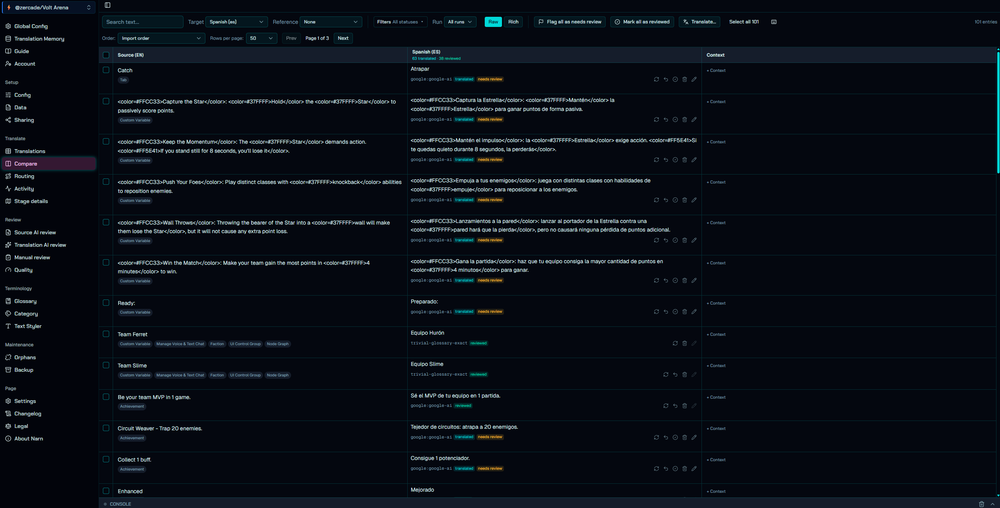
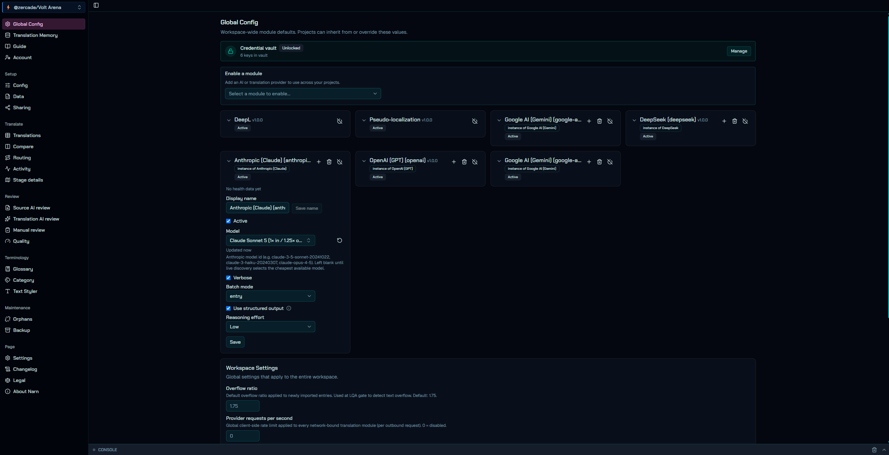
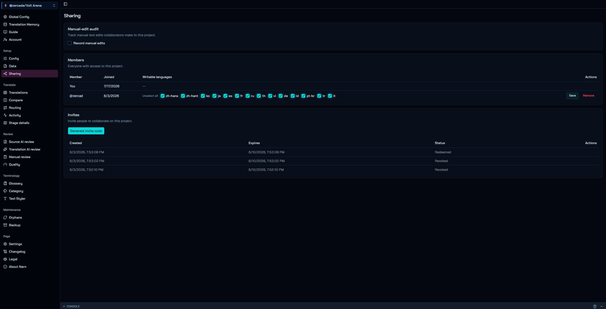
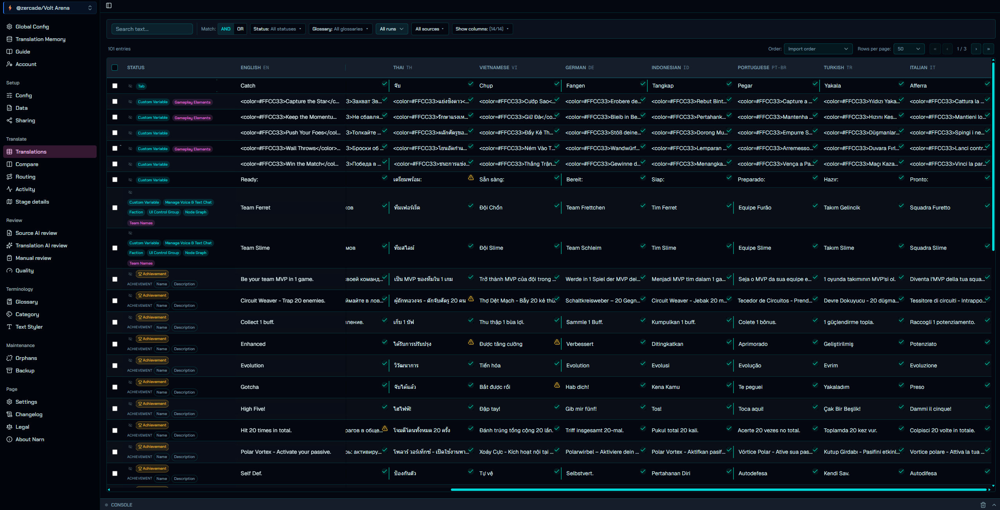
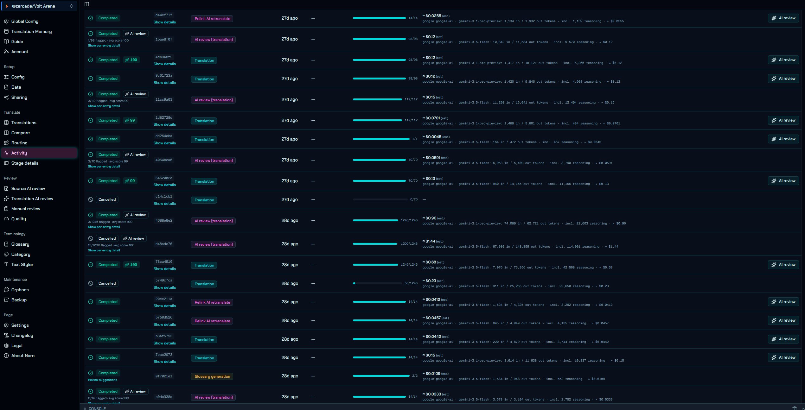
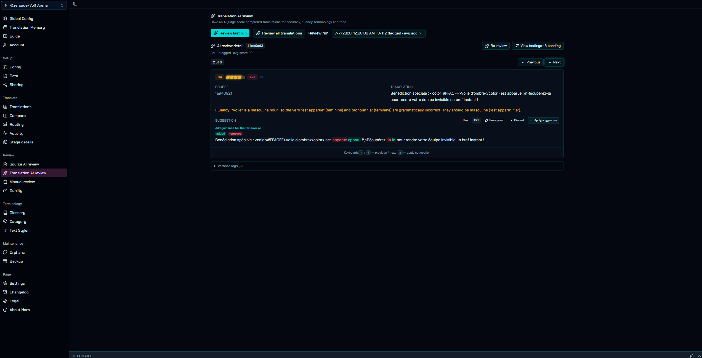

# NARN

[](https://github.com/zercade-dev/app-narn/actions/workflows/publish-image.yml)
[](https://github.com/zercade-dev/app-narn/actions/workflows/ci.yml)
[](https://github.com/zercade-dev/app-narn/actions/workflows/security.yml)
[](https://github.com/zercade-dev/app-narn/actions/workflows/docker-build.yml)

**Translate your Miliastra Wonderland Stage into every language the game speaks.**

NARN is a translation workbench built for Miliastra Wonderland Craftspeople. It reads the
CSV the game exports — a quirky, non-standard dialect that breaks ordinary spreadsheet
importers — ships **12 read-only glossaries (332 terms, 14 languages)** covering the game's
characters, elements, reactions, stats, nations, ranks and Miliastra's own vocabulary, and
writes back a file the game can import.

It connects to AI models (Claude, GPT, Gemini, DeepSeek, GitHub Copilot, and more — Google
AI Studio and OpenRouter both have free tiers) and classical machine translation (DeepL),
keeps your terminology consistent with glossaries, never re-translates the same line twice
with translation memory, and catches mistakes with AI-powered review — all from one
workbench.

Nothing about it is Miliastra-only: if you have a CSV of text in any language, NARN will
translate it. That is simply the workflow it was built around.

> NARN is an independent, fan-made tool. It is not affiliated with, endorsed by, or sponsored
> by HoYoverse / COGNOSPHERE PTE. LTD. Genshin Impact and Miliastra Wonderland are their
> trademarks. The bundled glossaries are unofficial fan-made terminology aids — see
> [TRADEMARKS.md](TRADEMARKS.md).



## Two ways to use it

**Hosted, at [narn.zercade.dev](https://narn.zercade.dev)** — sign in and start translating.
Nothing to install and nothing to maintain; connect your own AI provider keys, or use ones
already set up for you.

**Self-hosted, with Docker** — run it entirely on your own machine, with everything staying
local:

```bash
curl -O https://raw.githubusercontent.com/zercade-dev/app-narn/main/docker-compose.yml
docker compose up -d
```

Then open <http://127.0.0.1:3001> and create a vault password — your API keys are encrypted
and stored on your machine, never sent anywhere but the AI provider you connect. See
[Self-hosting in detail](#self-hosting-in-detail) below for the plain-Docker alternative and
building from source.

## What you can do with it

- **Glossaries** keep names, terms, and tone consistent everywhere they appear.
- **Translation memory** reuses your past translations, so identical or near-identical lines
  don't get re-translated (and re-billed) from scratch.
- **AI review** flags fluency, tone, and terminology problems and suggests fixes before you
  ship.
- **Collaborate, on the hosted version.** AI is optional — share a project with other people
  and ask them to help translate, scoped to just the languages they're responsible for. They
  can still use AI if they want to, with their own provider keys, not yours.
- **Classical machine translation.** DeepL is built in, for fast, non-AI translation whenever
  you'd rather not use an AI provider at all.
- **Bring your own model, self-hosted.** Beyond the built-in providers, point NARN at any
  OpenAI-compatible endpoint — including a local LLM running on your own hardware, for
  translations that never leave your machine.

## Screenshots

**Configure your providers** — connect any mix of AI providers and classical MT, side by side.



**Invite collaborators** — on the hosted version, give people write access to specific
languages only.



**Translate at scale** — every language for every string, side by side.



**Track runs and cost** — every translation and review run is logged with its cost.



**Catch mistakes before they ship** — AI review flags issues with one-click fixes.



## Self-hosting in detail

The command above is the fast path. For the plain-Docker alternative, what the volumes and
environment variables do, and building from source, see
[Self-hosting NARN](docs/self-hosting.md).

## Licence

NARN is licensed under the Business Source License 1.1 (`BUSL-1.1`) — see
[`LICENSE`](LICENSE), which is the authoritative text. In summary: production use is
permitted, including running a non-commercial hosted instance, but offering NARN to third
parties as a commercial hosted or managed service requires a separate licence. On the Change
Date stated in that file, the licence converts to the Apache License, Version 2.0.

Third-party code redistributed with NARN is covered by
[`THIRD-PARTY-NOTICES.md`](THIRD-PARTY-NOTICES.md). Trademark and no-affiliation statements
are in [`TRADEMARKS.md`](TRADEMARKS.md).
